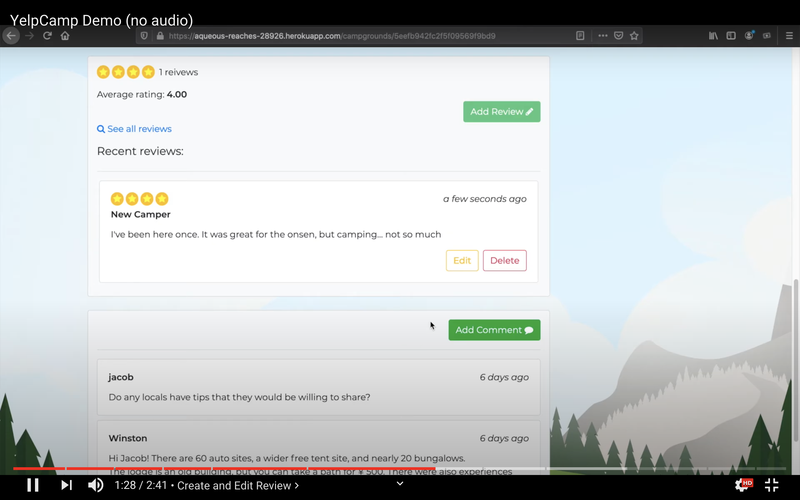

# [YelpCamp](https://www.yelpcamp.app/)
[](https://www.yelpcamp.app/)

[](https://codeclimate.com/github/JacobGrisham/YelpCamp/maintainability)
[](https://www.codacy.com/manual/JacobGrisham/YelpCamp?utm_source=github.com&amp;utm_medium=referral&amp;utm_content=JacobGrisham/YelpCamp&amp;utm_campaign=Badge_Grade)
[](https://www.codacy.com/gh/JacobGrisham/YelpCamp/dashboard?utm_source=github.com&utm_medium=referral&utm_content=JacobGrisham/YelpCamp&utm_campaign=Badge_Coverage)
[](https://app.circleci.com/pipelines/github/JacobGrisham/YelpCamp)


## 🎥 Walkthrough on Youtube
[](https://youtu.be/9IqcgAHhJ8k)

## 💡Lessons Learned
-	First full-stack web application
-	Introduction to [ExpressJS](https://expressjs.com/)
-	Introduction to [MongoDB](https://www.mongodb.com/) database design
-	Introduction to [Bootstrap 4](https://getbootstrap.com/)
-	Optimizing performance, security, and accessibility using [Google Lighthouse](https://developers.google.com/web/tools/lighthouse)
-	Integration testing with [Jest](https://jestjs.io/)
-	Code review with [Codacy](https://app.codacy.com/project/badge/Coverage/6272d48144774479b06e9b4b2caea0d6) and [CodeClimate](https://codeclimate.com/github/JacobGrisham/YelpCamp/maintainability)
-	CI/CD with [CircleCI](https://app.circleci.com/pipelines/github/JacobGrisham/YelpCamp)
-	Creating SVG illustrations with [Inkscape](https://inkscape.org/)
-	Deploying app to [Heroku](https://www.heroku.com/) and Database to [MongoDB Atlas](https://www.mongodb.com/cloud/atlas)
-	Using [Cloudflare](https://www.cloudflare.com/) as a Content Delivery Network in conjunction with custom [Google Domain](https://domains.google/) and Heroku

## 🛠 Technologies
|Graphic Design|Front-End|Back-End|Database|Deployment|Testing |
|------------- | ------- | ------ | ------ | -------- | -------|
|Inkscape	     |HTML5	   |Node.js |Mongoose|Heroku	  |Jest    |
|.			       |CSS3		 |ExpressJS|MongoDB|MongoDB Atlas|Lighthouse|
|.			       |Bootstrap 4|EJS	  |.		   |Git		    |.       |
|.			       |Javascript|.		  |.		   |.		      |.       |

## ⚖️ Methodology
-	Developed app in [GoormIDE](https://ide.goorm.io/) to gain exposure to cloud-based IDE.
-	[Bootstrap 4](https://getbootstrap.com/) as the CSS framework to keep the UI simple and quick to build.
-	[ExpressJS](https://expressjs.com/) as the Node.js application framework for its basic functionality. Some companies still use ExpressJS so it was important to implement it.
-	[PassportJs](https://github.com/jaredhanson/passport) for the authentication and authorization.
-	NoSQL database for the flexibility compared to a SQL database, [MongoDB](https://www.mongodb.com/) in particular because of its prevalence in the industry.
-	[Heroku](https://www.heroku.com/) for the CirceCI continous integration and development support. Application is kept awake from 6:00 a.m. to 11:59 p.m. PST with [Kaffeine](https://kaffeine.herokuapp.com/)
-	[Cloudflare](https://www.cloudflare.com/) for the free SSL certificate, which is needed for domain forwarding to [https://www.yelpcamp.app](https://www.yelpcamp.app). Cloudflare also offers improved security and performance over the defaults in Google Domains.

## ⚙️ Features
-	Login, sign-up, Admin role
-	REST API (create, read, update, delete) for campgrounds, comments, and reviews
-	Create routes have authentication
-	Edit, Update, and Delete routes have authentication and authorization
-	[Google Maps API](https://developers.google.com/maps/documentation)

## 🚀 Getting Started
### To run this project on your system:
Create an .env file and add values to the following variables:
```
GEOCODER_API_KEY=
API_KEY=
DATABASEURL=
PASSPORT_SECRET=
ADMIN_CODE=
```
Make sure you have [MongoDB](https://docs.mongodb.com/manual/installation/) installed on your system
In a terminal window, initialize a MongoDB Database 
```
$ ./mongod
```
In a second terminal window, access the MongoDB Database with Mongoose
```
$ mongoose
```
In a third terminal window, install dependencies using npm:

```
$ npm install
```
And then run the application with
```
$ npm start
```
or for hot reloading (recommended)
```
$ nodemon app.js
```

## 📐 Tests
The integration tests using [Jest](https://jestjs.io/) test the creation of data, the functionality of the schema, and the functionality of the validation. The tests are iterated over each of the models: campgrounds, comments, reviews, users.
To run the tests:
```
$ npm test
```

## 📣 Acknowledgments
-	The skeleton of this project was based on [Colt Steele's YelpCamp](https://github.com/Colt/yelp-camp-refactored) during the Web Development Bootcamp.

## 🔒 License
Copyright Notice and Statement: currently not offering any license. Permission only to view and download.
